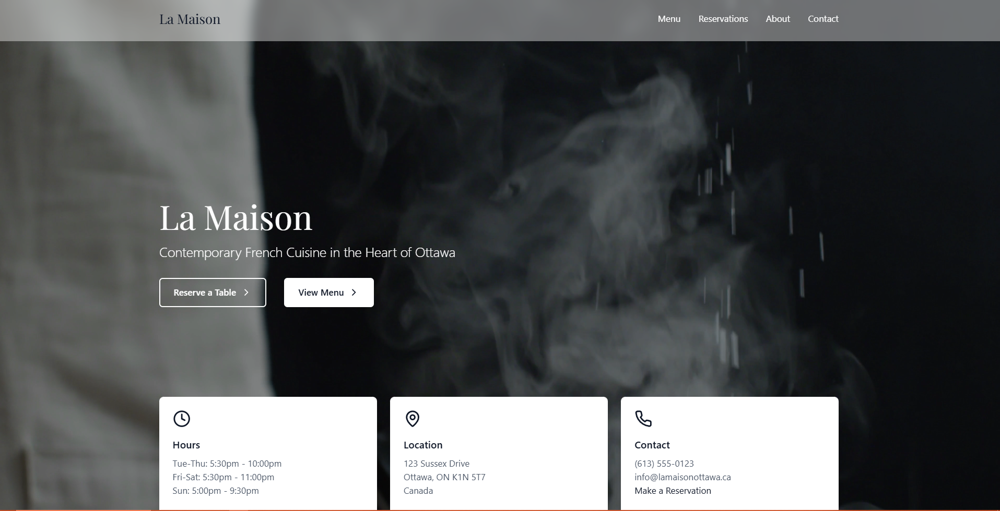

# La Maison - French Restaurant Website

#### *La Maison* is live [here](https://la-maison.pages.dev/)!

## Overview

La Maison is a sophisticated web application for an upscale French restaurant, built with React and modern web technologies. The site combines elegant design with smooth animations and responsive functionality to create an immersive dining experience for potential customers.

## Features

- **Interactive Menu Display**: Dynamic presentation of culinary offerings with beautiful imagery and descriptions
- **Real-time Reservation System**: Seamless booking experience for customers
- **Responsive Design**: Fully optimised for all devices (mobile, tablet, and desktop)
- **Animated UI Elements**: Smooth transitions and animations using Framer Motion
- **Contact Form Integration**: Secure form submission through Formspree
- **Dynamic Navigation**: Context-aware navigation with transparent/solid states
- **Performance Optimised**: Fast loading times with optimised assets and lazy loading
- **Accessibility Focused**: WCAG compliant with semantic HTML and ARIA attributes

## 🛠 Technology Stack

- [X] **Frontend Framework**: React.js
- [X] **Styling**: TailwindCSS for utility-first styling
- [X] **Animations**: Framer Motion
- [X] **Icons**: Lucide React
- [X] **Routing**: React Router v6
- [X] **Form Handling**: Formspree
- [X] **Development**: Vite for fast builds and hot module replacement

## Examples:

*Want to explore more? Check out more of my projects below:*

**Edu Resources:** https://eduresources.site/

**Moji Static Studios:** https://mojistaticstudios.com/

**Portfolio:** https://jolyssa.info/
